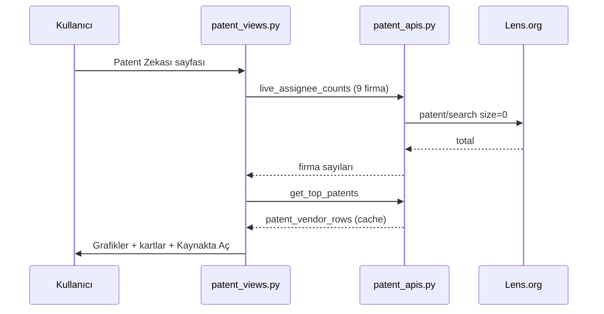
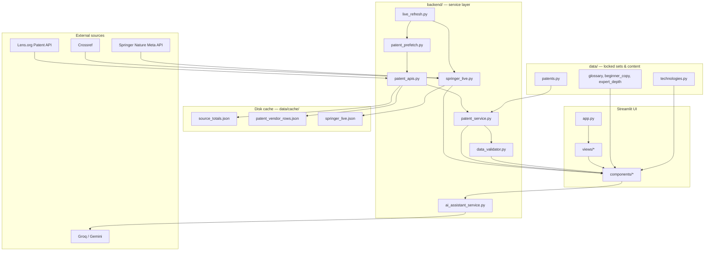
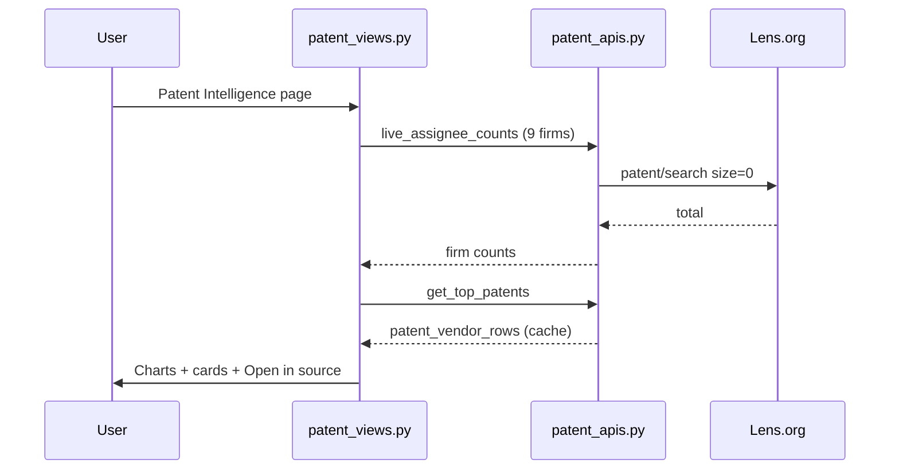

<div align="center">

# 6G Teknoloji & Patent Zekâsı Platformu  
# 6G Technology & Patent Intelligence Platform

**Türk Telekom 6G Ar-Ge · Technology, Patent Intelligence & Field Deployment Decision Portal**


**Geliştirici / Developer:** [Zeynep Ebrar Pala](https://github.com/zeynep-ebrar-pala)  
**Depo / Repository:** [6G-Teknoloji-Patent-Zekas--Platformu](https://github.com/zeynep-ebrar-pala/6G-Teknoloji-Patent-Zekas--Platformu)

**[Türkçe](#-türkçe)** · **[English](#-english)**

</div>

---

# 🇹🇷 Türkçe

## Özet

Tek portalda **7 temel 6G teknolojisi**, **Lens.org canlı patent analitiği** (9 rakip firma), **Springer Nature Meta API akademik yayın sayımı**, **Türk Telekom saha senaryoları** ve **Groq / Gemini AI asistan** bir arada sunulur. Tüm metrikler doğrulanabilir kaynaklara bağlıdır; API yanıt vermezse hücre boş kalır, sayı uydurulmaz.

**Güncel kod sürümü:** `2026-09-02-sunum-v5` (sidebar altında görünür)

## Temel yenilikler

| Yenilik | Açıklama |
|--------|----------|
| **Dual-Depth (Temel / Uzman)** | Her teknik içerik iki katman: Temel (nedir, neden, nasıl) + Uzman (denklem, varsayım). Uzman modu temeli gizlemez. |
| **TR / EN yerelleştirme** | Arayüz, grafik başlıkları ve pedagojik metinler `i18n/` üzerinden native TR ve EN. |
| **Lens.org canlı patent API** | `api.lens.org/patent/search` — firma × konu × yıl **toplam sayıları**; 100 satır tavanı grafiklerde kullanılmaz. |
| **Stale-while-revalidate** | Sayfa disk önbelleğinden anında açılır; Lens / Springer arka planda doldurulur, menü kilitlenmez. |
| **9 firma rakip analizi** | Nokia, Ericsson, Huawei, Samsung, Qualcomm, ZTE, NEC, NICT, Intel. |
| **7 konu 6G patent taraması** | ISAC, RIS, Cell-Free, THz, AI-RAN, NTN, Ambient IoT — ham «6G» gürültüsü filtrelenir. |
| **Sunum odaklı patent grafikleri** | Firma çubukları, yıl trendi, konu dağılımı, radar, treemap, yoğunluk ısı haritası, **konu daire haritası**, konu başına kelime çubukları. |
| **Springer Nature Meta API** | Akademik yayın sayımı; yıl ve ülke facet’leri; konular birbirine eklenmez. |
| **MNO yayın canlı sayımı** | Ülke başına kilitli operatör kümesi ile Springer metin araması. |
| **Source-locked doğrulama** | `backend/data_validator.py` — geçersiz URL veya eksik alan UI’da gösterilmez. |
| **Halüsinasyon önleme (AI)** | LLM patent no, DOI veya metrik icat etmez; yalnızca platform verisini yorumlar. |
| **TT Avrupa izi** | Doğrulanmış harita, patent/yayın kartları, Netsia kilitli küme. |
| **Kanıt radarı (Ana Sayfa)** | Lens patent × Springer yayın konu total’leri yan yana. |
| **Streamlit Cloud uyumu** | İnce boot, `APP_BUILD` deploy etiketi, secrets ile token yönetimi. |

## Veri kaynakları

### Patent — [Lens.org](https://www.lens.org)

| Öğe | Detay |
|-----|--------|
| **API** | `POST https://api.lens.org/patent/search` |
| **Kimlik doğrulama** | `LENS_TOKEN` (`.env` veya Streamlit Secrets) |
| **Abonelik** | [lens.org/lens/user/subscriptions](https://www.lens.org/lens/user/subscriptions) |
| **Sorgu mantığı** | 7 Explorer konusu (başlık / özet / claim OR) + `applicant.name` + isteğe bağlı `year_published` |
| **UI metrikleri** | Firma çubukları ve yıl trendleri = API **total**; patent kartları = çekilen **data** satırları (birleştirilmez) |
| **Derin link** | Her kart → `lens.org/lens/patent/{lens_id}` |

### Akademik yayın — [Springer Nature](https://www.springernature.com)

| Öğe | Detay |
|-----|--------|
| **API** | Springer Nature Meta API |
| **Kimlik doğrulama** | `SPRINGER_API_KEY` |
| **Kapsam** | 7 6G konusu, yıl penceresi 2022–2026, ülke facet (ilk 10 + Türkiye sırası) |
| **Atıf** | Çekilen kayıt + Crossref zenginleştirme |
| **Derin link** | DOI → Springer / Crossref |

### Diğer kaynaklar (isteğe bağlı)

| Kaynak | Ortam değişkeni | Kullanım |
|--------|-----------------|----------|
| Groq | `GROQ_API_KEY` | AI Asistan |
| Google Gemini | `GEMINI_API_KEY` | AI Asistan (yedek) |
| Elsevier / Scopus | `ELSEVIER_API_KEY`, `ELSEVIER_INST_TOKEN` | Kurumsal ülke facet |
| USPTO PatentsView | `PATENTSVIEW_API_KEY` | Yedek patent sayımı |
| EPO OPS | `EPO_OPS_KEY`, `EPO_OPS_SECRET` | Espacenet sayımı |

## Modüller

| Sayfa | Dosya | İçerik |
|-------|-------|--------|
| Ana Sayfa | `views/home.py` | TRL radar, 7 teknoloji KPI, kanıt radarı |
| 6G Teknoloji Rehberi | `views/tech.py` | Kavram, formül, performans grafikleri (Lens yıl total + Springer facet) |
| Patent Zekası | `views/patent.py` | Lens.org 9 firma analizi, grafikler, patent listesi |
| Akademik Yayın Analizi | `views/publications.py` | Springer konu / yıl / ülke grafikleri |
| Türk Telekom Görünümü | `views/tt.py` | Yapıldı / yol haritası, TT Avrupa izi, senaryolar |
| AI Asistan | `views/ai.py` | Groq / Gemini, doğrulanmış veri bağlamı |
| Hakkında | `views/about.py` | Amaç, yığın, metodoloji |

## Sistem mimarisi


## Patent analitiği akışı



## Proje ağacı

```text
MODUL1/
├── app.py                          # Giriş: sidebar TR/EN, Dual-Depth, st.navigation
├── styles.py                       # Türk Telekom koyu tema CSS
├── requirements.txt
├── .env.example                    # API anahtar şablonu (git’e girmez)
├── USAGE_GUIDE.md
│
├── views/                          # Streamlit sayfa yönlendiricileri
│   ├── home.py
│   ├── tech.py
│   ├── patent.py
│   ├── publications.py
│   ├── tt.py
│   ├── ai.py
│   └── about.py
│
├── components/                     # UI bileşenleri & Plotly grafikleri
│   ├── patent_views.py             # Lens.org rakip patent modülü
│   ├── academic_views.py           # Springer yayın modülü
│   ├── charts.py                   # Tüm Plotly grafikleri
│   ├── performance_charts.py       # Teknoloji performans grafikleri
│   ├── topic_panels.py             # 7 konu seçici
│   ├── tt_europe_views.py          # TT Avrupa harita & kartlar
│   ├── tt_page_views.py            # TT Görünümü düzeni
│   ├── tt_scenarios.py             # Saha senaryo çözümleyici
│   ├── ai_chat_view.py
│   ├── ui_helpers.py               # Kaynak linkleri, boş durum
│   └── diagrams.py
│
├── backend/                        # İş mantığı & API istemcileri
│   ├── config.py                   # .env / secrets okuma
│   ├── patent_apis.py              # Lens.org patent/search
│   ├── patent_service.py           # Patent metrikleri
│   ├── patent_prefetch.py          # Arka plan Lens doldurma
│   ├── springer_live.py            # Springer Meta canlı sayım
│   ├── mno_pub_live.py             # MNO operatör yayın sayımı
│   ├── live_refresh.py             # Stale-while-revalidate
│   ├── academic_service.py
│   ├── ai_assistant_service.py
│   ├── data_validator.py           # Source-locked filtre
│   ├── source_links.py             # Lens / DOI derin linkler
│   ├── tt_europe_service.py
│   ├── evidence_radar.py
│   └── scenario_engine.py
│
├── data/                           # Kilitli küme & pedagojik içerik
│   ├── patents.py                  # SPEC_COMPANIES, TECHNOLOGY_DOMAINS
│   ├── technologies.py             # 7 teknoloji TRL & formüller
│   ├── academic.py
│   ├── tt_europe.py
│   ├── glossary.py / glossary_en.py
│   ├── beginner_copy*.py / expert_depth*.py
│   ├── app_build.py                # Deploy sürüm etiketi
│   └── cache/                      # Lens / Springer disk önbelleği
│
├── i18n/
│   ├── core.py                     # t(), topic_label(), format_int
│   └── strings.py                  # TR / EN metinler
│
├── scripts/
│   ├── verify_sources.py           # URL erişilebilirlik testi
│   └── verify_live_refresh.py
│
└── .streamlit/
    └── config.toml
```

## Kurulum

```bash
git clone https://github.com/zeynep-ebrar-pala/6G-Teknoloji-Patent-Zekas--Platformu.git
cd 6G-Teknoloji-Patent-Zekas--Platformu
pip install -r requirements.txt
cp .env.example .env
```

`.env` minimum önerilen anahtarlar:

```env
LENS_TOKEN=your_lens_bearer_token
SPRINGER_API_KEY=your_springer_key
GROQ_API_KEY=your_groq_key
DEFAULT_AI_PROVIDER=groq
```

```bash
streamlit run app.py
```

Tarayıcı: `http://localhost:8501`

### Streamlit Cloud

Secrets paneline `.env` ile aynı anahtarları ekleyin. Deploy sonrası sidebar’da `Kod sürümü: …` satırı güncel commit’i yansıtır.

## Doğrulama

```bash
python scripts/verify_sources.py
python scripts/verify_live_refresh.py
```

## Güvenlik

- `.env` ve `.streamlit/secrets.toml` git’e **eklenmez**
- API anahtarları yalnızca sunucu tarafında (`backend/config.py`)
- LLM bağlamına yalnızca doğrulanmış platform verisi gider

## Lisans & atıf

© 2026 · Türk Telekom 6G Ar-Ge Staj Projesi · Zeynep Ebrar Pala

---

# 🇬🇧 English

## Overview

A single portal for **seven core 6G technologies**, **live Lens.org patent analytics** (nine competitor firms), **Springer Nature Meta API publication counts**, **Türk Telekom field scenarios**, and an optional **Groq / Gemini AI assistant**. Every metric links to a verifiable source; if an API does not respond, the cell stays empty—no invented numbers.

**Current build label:** `2026-09-02-sunum-v5` (shown at the bottom of the sidebar)

## Key innovations

| Innovation | Description |
|------------|-------------|
| **Dual-Depth (Basic / Expert)** | Two layers per topic: Basic (what / why / how) + Expert (equations, assumptions). Expert mode does not hide Basic. |
| **TR / EN i18n** | UI, chart titles, and pedagogical copy via native Turkish and English in `i18n/`. |
| **Live Lens.org patent API** | `api.lens.org/patent/search` — firm × topic × year **totals**; charts are not capped at 100 pulled rows. |
| **Stale-while-revalidate** | Pages open from disk cache instantly; Lens / Springer fill in the background without locking the sidebar. |
| **Nine-firm competitor analysis** | Nokia, Ericsson, Huawei, Samsung, Qualcomm, ZTE, NEC, NICT, Intel. |
| **Seven 6G patent topics** | ISAC, RIS, Cell-Free, THz, AI-RAN, NTN, Ambient IoT — raw “6G” noise filtered out. |
| **Presentation-ready patent charts** | Firm bars, year trends, topic mix, radar, treemap, density heatmap, **topic circle map**, per-topic keyword bars. |
| **Springer Nature Meta API** | Publication counts with year and country facets; topics are not summed together. |
| **MNO live publication counts** | Springer text search over a locked per-country operator set. |
| **Source-locked validation** | `backend/data_validator.py` — invalid URLs or missing fields never reach the UI. |
| **Hallucination-safe AI** | The LLM does not invent patent numbers, DOIs, or metrics; it only interprets platform data. |
| **TT Europe footprint** | Verified map, patent/paper cards, locked Netsia cluster. |
| **Evidence radar (Home)** | Lens patent vs Springer publication topic totals side by side. |
| **Streamlit Cloud ready** | Thin boot, `APP_BUILD` deploy tag, secrets-based tokens. |

## Data sources

### Patents — [Lens.org](https://www.lens.org)

| Item | Detail |
|------|--------|
| **API** | `POST https://api.lens.org/patent/search` |
| **Auth** | `LENS_TOKEN` (`.env` or Streamlit Secrets) |
| **Subscription** | [lens.org/lens/user/subscriptions](https://www.lens.org/lens/user/subscriptions) |
| **Query logic** | Seven Explorer topics (title / abstract / claim OR) + `applicant.name` + optional `year_published` |
| **UI metrics** | Firm bars & year trends = API **totals**; patent cards = pulled **data** rows (not merged) |
| **Deep link** | Each card → `lens.org/lens/patent/{lens_id}` |

### Publications — [Springer Nature](https://www.springernature.com)

| Item | Detail |
|------|--------|
| **API** | Springer Nature Meta API |
| **Auth** | `SPRINGER_API_KEY` |
| **Scope** | Seven 6G topics, year window 2022–2026, country facet (top 10 + Türkiye rank) |
| **Citations** | Pulled records + Crossref enrichment |
| **Deep link** | DOI → Springer / Crossref |

### Other sources (optional)

| Source | Environment variable | Use |
|--------|---------------------|-----|
| Groq | `GROQ_API_KEY` | AI Assistant |
| Google Gemini | `GEMINI_API_KEY` | AI Assistant (fallback) |
| Elsevier / Scopus | `ELSEVIER_API_KEY`, `ELSEVIER_INST_TOKEN` | Institutional country facet |
| USPTO PatentsView | `PATENTSVIEW_API_KEY` | Fallback patent counts |
| EPO OPS | `EPO_OPS_KEY`, `EPO_OPS_SECRET` | Espacenet counts |

## Modules

| Page | File | Content |
|------|------|---------|
| Home | `views/home.py` | TRL radar, seven technology KPIs, evidence radar |
| 6G Technology Guide | `views/tech.py` | Concepts, formulas, performance charts (Lens year totals + Springer facets) |
| Patent Intelligence | `views/patent.py` | Lens.org nine-firm analysis, charts, patent list |
| Publication Analysis | `views/publications.py` | Springer topic / year / country charts |
| Türk Telekom View | `views/tt.py` | Done / roadmap, TT Europe footprint, scenarios |
| AI Assistant | `views/ai.py` | Groq / Gemini with verified data context |
| About | `views/about.py` | Purpose, stack, methodology |

## System architecture



## Patent analytics flow



## Project tree

```text
MODUL1/
├── app.py                          # Entry: sidebar TR/EN, Dual-Depth, st.navigation
├── styles.py                       # Türk Telekom dark theme CSS
├── requirements.txt
├── .env.example                    # API key template (not in git)
├── USAGE_GUIDE.md
│
├── views/                          # Streamlit page routers
│   ├── home.py
│   ├── tech.py
│   ├── patent.py
│   ├── publications.py
│   ├── tt.py
│   ├── ai.py
│   └── about.py
│
├── components/                     # UI widgets & Plotly charts
│   ├── patent_views.py             # Lens.org competitor patent module
│   ├── academic_views.py           # Springer publication module
│   ├── charts.py                   # All Plotly charts
│   ├── performance_charts.py       # Technology performance charts
│   ├── topic_panels.py             # Seven-topic selector
│   ├── tt_europe_views.py          # TT Europe map & cards
│   ├── tt_page_views.py            # TT View layout
│   ├── tt_scenarios.py             # Field scenario solver
│   ├── ai_chat_view.py
│   ├── ui_helpers.py               # Source links, empty states
│   └── diagrams.py
│
├── backend/                        # Business logic & API clients
│   ├── config.py                   # .env / secrets loader
│   ├── patent_apis.py              # Lens.org patent/search
│   ├── patent_service.py           # Patent metrics
│   ├── patent_prefetch.py          # Background Lens prefetch
│   ├── springer_live.py            # Springer Meta live counts
│   ├── mno_pub_live.py             # MNO operator publication counts
│   ├── live_refresh.py             # Stale-while-revalidate
│   ├── academic_service.py
│   ├── ai_assistant_service.py
│   ├── data_validator.py           # Source-locked filter
│   ├── source_links.py             # Lens / DOI deep links
│   ├── tt_europe_service.py
│   ├── evidence_radar.py
│   └── scenario_engine.py
│
├── data/                           # Locked sets & pedagogical content
│   ├── patents.py                  # SPEC_COMPANIES, TECHNOLOGY_DOMAINS
│   ├── technologies.py             # Seven technologies TRL & formulas
│   ├── academic.py
│   ├── tt_europe.py
│   ├── glossary.py / glossary_en.py
│   ├── beginner_copy*.py / expert_depth*.py
│   ├── app_build.py                # Deploy version label
│   └── cache/                      # Lens / Springer disk cache
│
├── i18n/
│   ├── core.py                     # t(), topic_label(), format_int
│   └── strings.py                  # TR / EN strings
│
├── scripts/
│   ├── verify_sources.py           # URL reachability test
│   └── verify_live_refresh.py
│
└── .streamlit/
    └── config.toml
```

## Setup

```bash
git clone https://github.com/zeynep-ebrar-pala/6G-Teknoloji-Patent-Zekas--Platformu.git
cd 6G-Teknoloji-Patent-Zekas--Platformu
pip install -r requirements.txt
cp .env.example .env
```

Recommended minimum keys in `.env`:

```env
LENS_TOKEN=your_lens_bearer_token
SPRINGER_API_KEY=your_springer_key
GROQ_API_KEY=your_groq_key
DEFAULT_AI_PROVIDER=groq
```

```bash
streamlit run app.py
```

Browser: `http://localhost:8501`

### Streamlit Cloud

Add the same keys to the Secrets panel. After deploy, the sidebar **Code build** line reflects the latest commit.

## Verification

```bash
python scripts/verify_sources.py
python scripts/verify_live_refresh.py
```

## Security

- `.env` and `.streamlit/secrets.toml` are **not** committed
- API keys exist only server-side (`backend/config.py`)
- LLM context receives verified platform data only

## License & attribution

© 2026 · Türk Telekom 6G R&D Internship Project · Zeynep Ebrar Pala

---

<div align="center">

Detaylı kullanım adımları · Step-by-step usage: **[USAGE_GUIDE.md](USAGE_GUIDE.md)**

</div>
