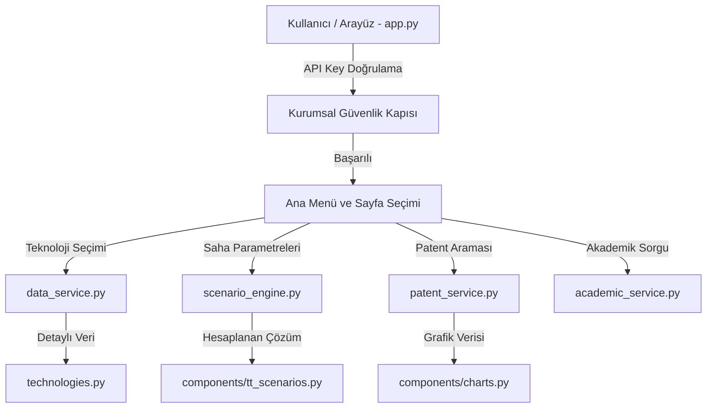

<div align="center">

# 🇹🇷 Türk Telekom 6G Teknoloji & Patent Zekası Platformu
### *6G Technology, Patent Intelligence & Field Deployment Decision Platform*


<p align="center">
  <b>Türk Telekom 6G Ar-Ge ekibi, yöneticiler ve araştırmacılar için tasarlanmış çift katmanlı (Dual-Depth) interaktif analiz, patent zekası ve saha karar destek platformu.</b>
</p>

---

</div>

## 📌 Proje Hakkında (Executive Summary)

**Türk Telekom 6G Teknoloji & Patent Zekası Platformu**, 6. Nesil (6G) kablosuz haberleşme teknolojilerini hem 0 seviye teknik bilgisi olan karar vericilerin kolayca kavrayabileceği hem de 6G Ar-Ge uzmanlarının akademik ve teknik derinlik beklentilerini karşılayacak şekilde tasarlanmış **çift katmanlı (Dual-Depth)** kurumsal bir web platformudur.

Platform; 7 temel 6G teknolojisinin fiziksel prensiplerinden global patent dağılımına, akademik yayın trendlerinden Türk Telekom'un Türkiye geneli saha senaryoları hesaplama motoruna kadar uçtan uca karar destek araçları sunar.

---

## 🌟 Öne Çıkan Özellikler ve Modüller

### 🔒 1. Kurumsal Güvenlik Kapısı (API Key Authentication)
- Kurumsal güvenlik standartlarına uygun erişim kontrolü.
- **Varsayılan Giriş Anahtarı:** `TT-6G-2026-KEY` (veya kişisel Ar-Ge API Key).

### 🏠 2. Ana Sayfa & TRL Radar Haritası
- **TRL Radar Analizi:** 7 Temel 6G teknolojisinin Teknoloji Hazırlık Seviyeleri (TRL 1-9) interaktif Plotly radar grafiğinde görselleştirilir.
- **Yönetici KPI Kartları:** TRL ortalamaları, küresel patent hacmi ve 3GPP Rel-18/19/20 hedef çizelgeleri.

### 📡 3. Modül 1 — 6G Teknoloji Keşfi (Dual-Depth Technology Explorer)
- **🌱 Temel Seviye:** Günlük hayat analojileri, yönetici özetleri, kullanım senaryoları ve kısa PoC video demonstrasyon kartları.
- **⚡ Uzman Seviyesi:** Derin RF/Fiziksel prensipler, canlı SVG sinyal akış diyagramları, matematiksel sinyal formülleri, 3GPP standartları ve IEEE referans belgeleri.

### 📜 4. Modül 2 — Patent Zekası ve Rakip Analizi (Patent Intelligence)
- Global 6G patent liderlerinin (Huawei, Samsung, Qualcomm, Ericsson, Nokia, Türk Telekom vb.) pay analizi.
- IPC sınıflandırması (H04B, H04W, H01Q), patent atıf ağları ve teknolojiye göre patent arama/filtreleme motoru.

### 📊 5. Modül 3 — Akademik Yayın Analizi (Academic Literature Intelligence)
- IEEE Xplore, Nature Electronics ve 3GPP standartlarındaki 6G literatür trendleri.
- Üniversite/Enstitü katkı skorları, yıllık yayın artış grafikleri ve makale referans veritabanı.

### 🇹🇷 6. Türk Telekom Saha Senaryo Çözümleyici (TT Scenario Engine)
- Bölge tipi (Metropol, Deniz/Boğaz, Kırsal, Afet Bölgesi), öncelik ve bütçeye göre en optimal 6G mimari çözümlerini ve anten dağıtım önerilerini üreten hesaplama motoru.
- **Özel Saha Senaryoları:** İstanbul Boğazı Deniz Emniyeti, İHA Koridoru, Deprem RF Enkaz Algılama, Stadyum/Konser Aşırı Yoğunluk Kapsaması.

### 🧠 7. Modül 4 — Türk Telekom 6G AI Asistanı
- 6G standartları, RF parametreleri, patent durumu ve saha kurulumları hakkında anlık soru-cevap sunan yapay zeka asistanı.

---

## 🏗️ Sistem Mimarisi & Proje Ağacı

Sistem modüler ve clean-architecture ilkelerine uygun şekilde ayrıştırılmıştır:

```text
MODUL1/
├── 📄 app.py                      # Ana Streamlit Giriş Noktası & Sayfa Yönlendirici
├── 🎨 styles.py                   # Türk Telekom Kurumsal Tasarım Kimliği (Glassmorphism & CSS)
├── 📦 requirements.txt            # Streamlit Cloud Bağımlılık Listesi
├── ⚙️ .streamlit/
│   └── config.toml                # Streamlit Sunucu ve Tema Yapılandırması
├── 📄 README.md                   # Kurumsal Proje Dokümantasyonu
├── 📄 USAGE_GUIDE.md               # Detaylı Kullanım ve Dağıtım Kılavuzu
│
├── 📂 backend/                    # ⚙️ BACKEND (Servis ve Hesaplama Katmanı)
│   ├── data_service.py            # Teknolojik Veri Erişim Servisleri
│   ├── scenario_engine.py         # Türk Telekom Saha Dağıtım Hesaplama Motoru
│   ├── patent_service.py          # Patent Analitik Servisi
│   ├── academic_service.py        # Akademik Literatür Analiz Servisi
│   └── ai_assistant_service.py    # AI Asistan Yanıt Motoru
│
├── 📂 components/                 # 🎨 FRONTEND (Görsel Arayüz Bileşenleri)
│   ├── diagrams.py                # Canlı SVG/HTML Animasyonlu Blok Diyagramları
│   ├── charts.py                  # Plotly Etkileşimli TRL Radar ve Performans Grafikleri
│   ├── tt_scenarios.py            # Türk Telekom Senaryo Çözümleyici Arayüzü
│   ├── patent_views.py            # Patent Analitiği Görünümleri
│   ├── academic_views.py          # Akademik Yayın Görünümleri
│   └── ai_chat_view.py            # AI Chatbot Kullanıcı Arayüzü
│
└── 📂 data/                       # 💾 DATA (Statik ve Simüle Veri Tabanı)
    ├── technologies.py            # 7 Temel 6G Teknolojisinin Detaylı Veri Modeli
    ├── patents.py                 # Patent Veritabanı ve Metrikler
    └── academic.py                # Akademik Yayın Verileri
```

### 🔀 Veri ve Akış Mimarisi



---

## 📊 Kapsanan 7 Temel 6G Teknolojisi

| No | Teknoloji Adı | TRL | Frekans Bandı | 3GPP Hedef Sürümü | Türk Telekom Ana Kullanım Alanı |
|---|---|:---:|:---:|:---:|---|
| **1** | **ISAC** *(Integrated Sensing & Comm.)* | TRL 4 | Sub-6GHz / mmWave / THz | Rel-19 / Rel-20 | İstanbul Boğazı Deniz Emniyeti & Radar |
| **2** | **RIS** *(Reconfigurable Intelligent Surfaces)* | TRL 5 | Sub-6GHz / mmWave | Rel-18 / Rel-19 | Şehir İçi Bina Kör Noktalarını Yansıtıcı İle Kapsama |
| **3** | **Cell-Free Massive MIMO** | TRL 4 | Sub-6GHz / FR2 | Rel-19 | Stadyum & Konser Gibi Aşırı Yoğun Alanlar |
| **4** | **THz Communication** | TRL 3 | 0.1 THz - 1 THz | Rel-20+ | Veri Merkezi Kablosuz Terabit Bağlantıları |
| **5** | **AI-Native RAN** | TRL 5 | Tüm Bantlar | Rel-18 / Rel-19 | Otonom Ağ Yönetimi & Dinamik Enerji Tasarrufu |
| **6** | **NTN** *(Non-Terrestrial Networks)* | TRL 6 | Ku / Ka / L-Band | Rel-18 | LEO Uydu İle Kesintisiz Kırsal Kapsama |
| **7** | **Ambient IoT** *(Zero-Energy Devices)* | TRL 4 | Sub-1GHz / Sub-6GHz | Rel-19 | Pilsiz Sensörler İle Akıllı Şehir & Tarım |

---

## 🚀 Yerel Kurulum ve Çalıştırma (Local Setup)

### 1. Depoyu Klonlayın
```bash
git clone https://github.com/zeynep-ebrar-pala/6G-Teknoloji-Patent-Zekas--Platformu.git
cd 6G-Teknoloji-Patent-Zekas--Platformu
```

### 2. Gerekli Bağımlılıkları Yükleyin
```bash
pip install -r requirements.txt
```

### 3. Uygulamayı Başlatın
```bash
streamlit run app.py
```

Uygulama tarayıcınızda otomatik olarak `http://localhost:8501` adresinde açılacaktır. Giriş için `TT-6G-2026-KEY` anahtarını kullanabilirsiniz.
---


## 🛠️ Teknoloji Yığını (Tech Stack)

- **Frontend:** Streamlit 1.30+, Custom CSS (Glassmorphism), HTML5/SVG Animations
- **Backend:** Python 3.9+, Modular Data Services, Dynamic Evaluation Engine
- **Veri Görselleştirme:** Plotly Express & Graph Objects (TRL Radar, Bar, Scatter)
- **Veri İşleme:** Pandas, Scikit-Learn, NetworkX
- **Dağıtım (Deployment):** GitHub, Streamlit Cloud

---

## 📜 Lisans ve Haklar

© 2026 **Türk Telekom Ar-Ge Ekibi**. Tüm Hakları Saklıdır.
Bu platform Türk Telekom 6G Ar-Ge ve Patent Stratejisi kapsamında geliştirilmiştir.
